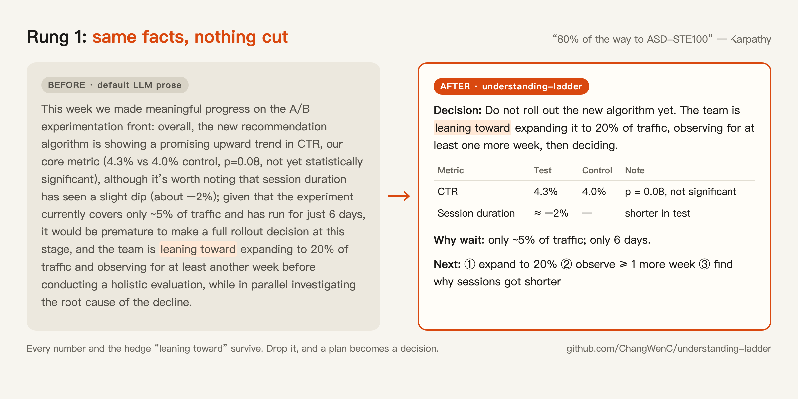
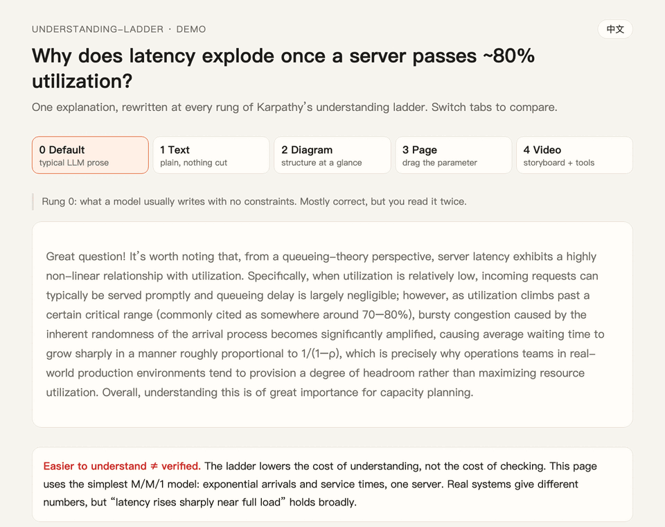

# understanding-ladder

**Agent skills that make LLM explanations easier to understand — built on Karpathy's understanding ladder.**

English | [中文](README.zh-CN.md)

[](LICENSE)  



```bash
npx skills add ChangWenC/understanding-ladder
```

**[Live demo →](https://changwenc.github.io/understanding-ladder/docs/demo/)** one explanation, rewritten at every rung.

---

## Why

In October 2026, Andrej Karpathy [wrote](https://x.com/karpathy/status/2105819303471976479) that LLM output is nearly free; *understanding* it is the bottleneck. So stop accepting walls of text and ask for formats that are easier to understand. He ranked four, each "even better" than the last:

| Rung | Format | Why it helps |
|---|---|---|
| 1 | Text in ASD-STE100 (controlled English) | One idea per sentence, one meaning per word |
| 2 | Diagram | Structure laid out at once instead of line by line |
| 3 | Interactive HTML page | Move the parameter, see the result change |
| 4 | 3Blue1Brown-style explainer video | Animation + narration for processes over time |

The hard part is not knowing the ladder. It is **picking the right rung every time** without being asked — and not climbing higher than the question needs. This repo turns that into a skill.

## What you get

### `understanding-ladder` — which format

Classifies the content, recommends the **lowest rung that fully answers**, and produces it:

| Content | Rung | Output |
|---|---|---|
| Definition, fact, procedure | 1 · text | ~80% ASD-STE100 in English, `plain-chinese` in Chinese |
| Process, causality, states, components | 2 · diagram | Mermaid / SVG + "how to read this diagram" |
| A parameter changes the outcome | 3 · page | Single-file HTML with sliders, opens with a double-click |
| A derivation that unfolds over time | 4 · video | Storyboard + narration + tool links (does not render) |

Three rules hold on every rung:

- **Nothing cut.** Simple language, not less content. Every number, condition, and hedge survives.
- **Draft first.** Every diagram, page, or video starts from a rung-1 text draft you can check.
- **"What to check" at the end.** Easier to understand ≠ verified.

Works in English and Chinese — it replies in your language.

→ [SKILL.md](skills/understanding-ladder/SKILL.md) · [English examples](examples/understanding-ladder/en/) · [Chinese examples](examples/understanding-ladder/)

### `plain-chinese` — rung 1 for Chinese

In English you can just say "in ASD-STE100" and the model knows the rules. **Chinese has no such name.** `plain-chinese` spells the rules out: 15 of them, grouped into words, sentences, paragraphs, what to delete, and what to keep. `understanding-ladder` calls it automatically for Chinese output.

→ [SKILL.md](skills/plain-chinese/SKILL.md) · [5 before/after pairs](examples/plain-chinese/)

## Demo: one explanation, every rung

Topic: **why does server latency explode once utilization passes ~80%?**



[Open the live demo](https://changwenc.github.io/understanding-ladder/docs/demo/) (English / 中文 toggle, single file, no dependencies). Tab 3 has a slider: drag utilization from 90% to 95% — five more points, double the latency.

## Install

**Any agent that supports [Agent Skills](https://agentskills.io)** (Claude Code, Codex, Cursor, …), via [skills](https://github.com/vercel-labs/skills):

```bash
npx skills add ChangWenC/understanding-ladder
```

**Claude Code plugin:**

```text
/plugin marketplace add ChangWenC/understanding-ladder
/plugin install understanding-ladder@understanding-ladder
```

**Manual** (Claude Code global skills directory):

```bash
git clone --depth 1 https://github.com/ChangWenC/understanding-ladder.git
cp -r understanding-ladder/skills/* ~/.claude/skills/
```

## Use

Just ask. The skill triggers from its description:

```text
Help me understand how learning rate affects convergence.
Explain the TLS 1.3 handshake the clearest way.
An agent wrote this plan — help me see what it actually does.
Walk me through the Fourier series from rung 1 to rung 4.
```

No install? Paste this (Karpathy's "80%" plus the one rule that matters most):

```text
Write about 80% of the way to ASD-STE100: one idea per sentence, one term per meaning, active voice, no filler. Cut nothing — keep every fact, number, condition, and hedge; just make the sentences clean.
```

## Limits

- **Easier to understand ≠ verified.** The ladder lowers the cost of understanding, not of checking. A polished artifact lowers your guard; an error in an animation is more convincing than in text. Hence "What to check" on every output.
- Rung 4 delivers a storyboard and toolchain; it does not render video.
- `plain-chinese` is a lightweight rule set for LLMs, not a full writing standard. Sentence-length numbers are rules of thumb, not tested in reading studies.
- The examples were produced by following the skills and checked by hand. They show direction, not a benchmark.

## Related work

| Project | What it does | Difference |
|---|---|---|
| [FutureAtoms/karpathy-ladder](https://github.com/FutureAtoms/karpathy-ladder) | English ladder skill; renders diagrams, spec sheets, and video with Playwright/Manim | This repo is zero-dependency, picks the *lowest* sufficient rung, and covers Chinese |
| [danyuchn/asd-ste100-skill](https://github.com/danyuchn/asd-ste100-skill) | English STE rewriting with a linter | Rung 1 only; this repo covers the whole ladder |
| [mzopedia/simplified-technical-chinese](https://github.com/mzopedia/simplified-technical-chinese) | A full Simplified Technical Chinese spec: 40 rules, word list, checker | Heavier and more formal; use it for documentation. `plain-chinese` targets LLM explanations |

Ideas only; no content copied.

## Credits

- The ladder comes from [Andrej Karpathy's post](https://x.com/karpathy/status/2105819303471976479).
- Rung 1 is **inspired by [ASD-STE100](https://www.asd-ste100.org/); not affiliated with ASD.** No STE rule text or dictionary is reproduced. ASD-STE100 is a registered trademark of ASD.
- Rung 4 tools: [showtime](https://github.com/FavioVazquez/showtime), [Manim](https://www.manim.community/), [Kokoro](https://github.com/hexgrad/kokoro).

## License

[MIT](LICENSE)
