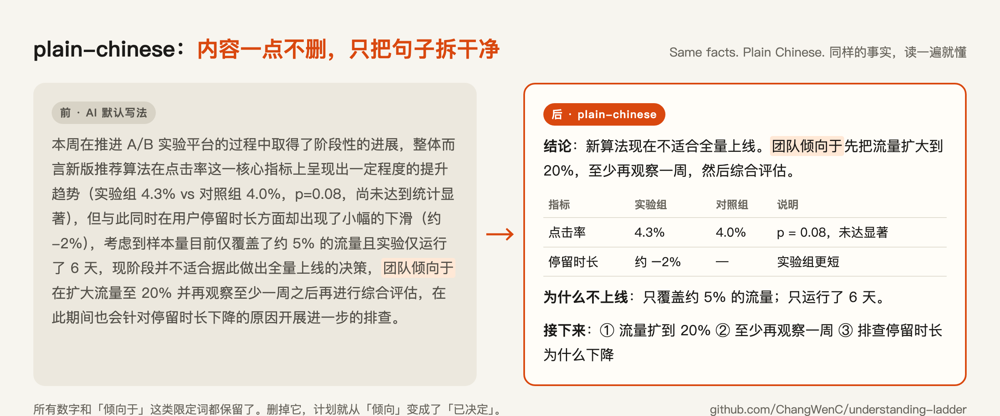
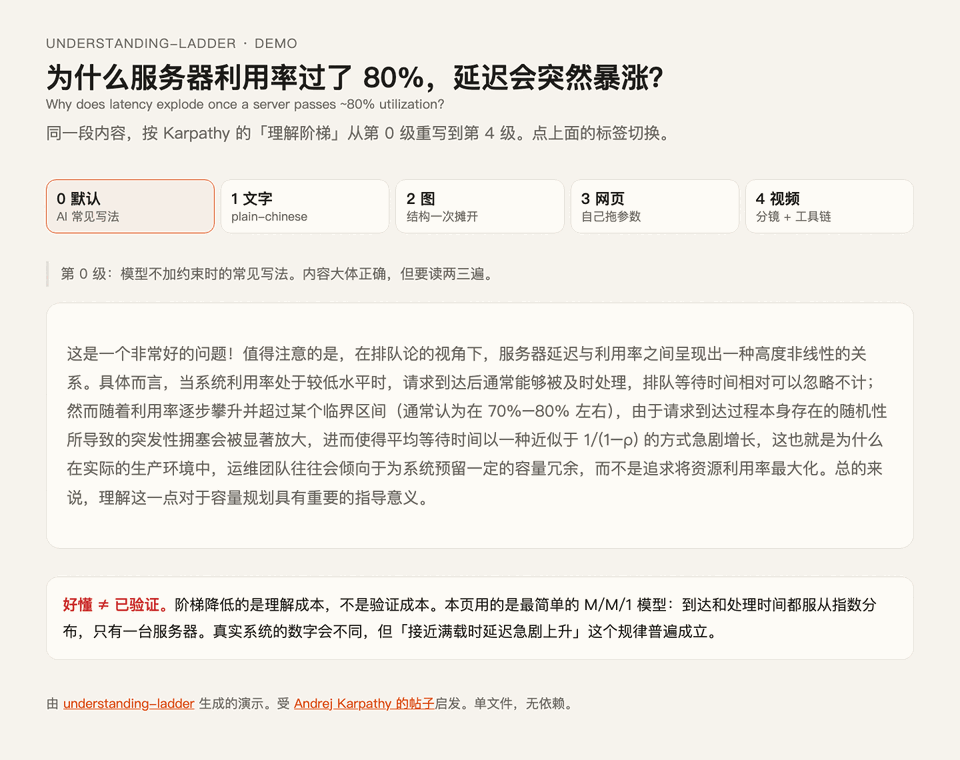

# understanding-ladder

**让 AI 的解释更好懂：两个中文 Agent Skill，按 Karpathy 的「理解阶梯」设计。**
Two Chinese agent skills that make AI explanations easier to understand, built on Karpathy's "understanding ladder". [English ↓](#english)

[](LICENSE)  



```bash
npx skills add ChangWenC/understanding-ladder
```

---

## 为什么做这个

2026 年 10 月，Andrej Karpathy [发帖](https://x.com/karpathy/status/2105819303471976479)说：LLM 的产出几乎不花钱，人能看懂多少才是瓶颈。所以别接受默认的大段文字，要主动要求更好懂的格式。他排了四级，每一级都比上一级更好懂：

| 级 | 格式 | 为什么更好懂 |
|---|---|---|
| 1 | 用 ASD-STE100（受控英语）写 | 一句一事、一词一义，读一遍不会读错 |
| 2 | 图 | 文字是线性的；图把结构一次摊开 |
| 3 | HTML 交互网页 | 自己拖参数，亲眼看结果怎么变 |
| 4 | 3b1b 风格讲解视频 | 动画展示过程，旁白同步解释 |

英文用户只要说一句「in ASD-STE100」，模型就会调出整套规则。**中文没有这样一个名字。** 所以这个仓库做了两件事：

- 把第 1 级的写法写成一份中文规则清单：**`plain-chinese`**。
- 把整条阶梯做成一个可以安装的 skill：**`understanding-ladder`**。

## 两个 skill

### `plain-chinese`：规定「怎么写」

15 条规则，分成「词、句、段、删掉什么、保留什么」五组。最重要的一条：

> **简单指语言简单，不指内容变少。** 每个事实、数字、条件、「通常」「可能」这类限定词都保留。改写后可以比原文长。

几乎所有中文解释都能用：技术概念、操作步骤、学习笔记、周报，以及「帮我看懂 agent 刚才干了什么」。

→ [规则全文](skills/plain-chinese/SKILL.md) · [5 组前后对照](examples/plain-chinese/)

### `understanding-ladder`：决定「用什么格式」

先判断内容类型，再推荐一级，然后直接按该级的做法产出：

| 内容类型 | 推荐 | 产出 |
|---|---|---|
| 定义、事实、步骤 | ① 文字 | 调用 `plain-chinese` |
| 流程、因果、状态、组件关系 | ② 图 | Mermaid / SVG，加「怎么读这张图」 |
| 参数影响结果、方案取舍 | ③ 网页 | 单文件 HTML，带滑块，双击就能打开 |
| 随时间展开的推导、几何直觉 | ④ 视频 | 分镜 + 旁白 + 工具链（不自己渲染） |

规则：用户指定格式就听用户的；否则选能讲清问题的**最低**一级。每一级都先写简明文字稿，再升级。每个产出末尾都附「需要核对」。

→ [SKILL.md](skills/understanding-ladder/SKILL.md) · [5 个示例](examples/understanding-ladder/)

## 演示：同一段内容，从第 0 级讲到第 4 级

话题：**为什么服务器利用率过了 80%，延迟会突然暴涨？**



**[在线打开演示页 →](https://changwenc.github.io/understanding-ladder/docs/demo/)**（源文件：[docs/demo/index.html](docs/demo/index.html)，单文件，无依赖），切换 0–4 级的标签，看格式本身怎么改变理解的难度。

## 安装

**任意支持 Agent Skills 的 agent**（Claude Code、Codex、Cursor 等），用 [skills](https://github.com/vercel-labs/skills) 安装：

```bash
npx skills add ChangWenC/understanding-ladder
```

**Claude Code 插件**：

```text
/plugin marketplace add ChangWenC/understanding-ladder
/plugin install understanding-ladder@understanding-ladder
```

**手动复制**到 Claude Code 的全局目录（其他 agent 的目录各不相同，推荐用上面的 `npx skills add`）：

```bash
git clone --depth 1 https://github.com/ChangWenC/understanding-ladder.git
cp -r understanding-ladder/skills/* ~/.claude/skills/
```

## 怎么用

正常说话就行，skill 会按描述自动触发：

```text
用简明中文改写这段周报：……
这是 agent 的总结，我看不懂，帮我改成好懂的中文。
帮我理解：学习率是怎么影响收敛的？用最好懂的方式讲。
用理解阶梯，把 HTTPS 握手从第 1 级讲到第 4 级。
```

不装 skill 时，也可以把这段放进提示词（这就是 Karpathy 说的「做到八成」）：

```text
用简明中文写：一句只讲一件事，每句尽量不超过 25 字；术语第一次出现给定义，之后不换说法；用主动句，写清谁做什么；多用肯定句；删掉铺垫、客套和「值得注意的是」；内容一点不删——事实、数字、条件和限定词都保留，只把句子拆干净。
```

## 限制

- **好懂 ≠ 已验证。** 阶梯降低的是理解成本，不是验证成本。越好懂、越精美的产物越容易让人放下戒心——动画里的错误比文字里的更有说服力。所以每个产出都附「需要核对」。
- `plain-chinese` 是给 LLM 用的轻量规则，不是一套完整的写作标准。句长等数字是经验值，没有做过阅读实验。
- 第 4 级只给分镜和工具链，不渲染视频。
- 示例由作者按 skill 跑出并人工核对，数量少，只能说明方向。

## 和相关项目的关系

| 项目 | 做什么 | 本仓库的区别 |
|---|---|---|
| [danyuchn/asd-ste100-skill](https://github.com/danyuchn/asd-ste100-skill) | 英文 STE 改写 skill，带 lint 脚本 | 本仓库是中文，并把 STE 放进四级阶梯 |
| [FutureAtoms/karpathy-ladder](https://github.com/FutureAtoms/karpathy-ladder) | 英文的阶梯 skill，自动渲染图、规格页和视频 | 本仓库是中文，零依赖，第 4 级只出分镜 |
| [mzopedia/simplified-technical-chinese](https://github.com/mzopedia/simplified-technical-chinese) | 完整的「简明技术中文」规范：40 条规则、词表、检查脚本 | 本仓库更轻，专门改写 AI 的解释，强调内容不删。要写正式技术文档，推荐用它 |
| [ruanyf/document-style-guide](https://github.com/ruanyf/document-style-guide) | 中文技术文档的排版和结构规范 | 互补：它管排版，本仓库管句子 |

以上项目只参考了思路，没有复制内容。

## 致谢

- 思路和四级阶梯来自 [Andrej Karpathy 的帖子](https://x.com/karpathy/status/2105819303471976479)。
- 第 1 级的写法受 [ASD-STE100](https://www.asd-ste100.org/) 启发。**Inspired by ASD-STE100; not affiliated with ASD.** 本仓库没有复制 STE 的规则原文或词典。ASD-STE100 是 ASD 的注册商标。
- 第 4 级推荐的工具：[showtime](https://github.com/FavioVazquez/showtime)、[Manim](https://www.manim.community/)、[Kokoro](https://github.com/hexgrad/kokoro)。

## 许可

[MIT](LICENSE)

---

<a id="english"></a>

## English

**Two agent skills that make AI explanations easier to understand, in Chinese.**

In October 2026 Andrej Karpathy [argued](https://x.com/karpathy/status/2105819303471976479) that LLM output is nearly free and human understanding is the bottleneck. He ranked four output formats, each "even better" than the last: text in ASD-STE100, diagrams, HTML pages, and 3Blue1Brown-style explainer videos.

In English, "in ASD-STE100" is enough to summon the whole rule set. **Chinese has no such name.** This repo fills that gap:

- **`plain-chinese`** — *how to write.* 15 explicit rules for plain Chinese: one idea per sentence, one meaning per term, active voice, no filler. The key rule: **simple language, not less content** — every fact, number, condition and hedge stays.
- **`understanding-ladder`** — *which format.* Classifies the content (definition/steps, process/causality, parameter → outcome, unfolding derivation), recommends the lowest rung that fully answers, and produces it: plain text (via `plain-chinese`), a Mermaid/SVG diagram, a single-file interactive HTML page, or a video storyboard with tool links (it does not render video).

**Demo:** the same explanation ("why latency explodes past ~80% utilization") rewritten at levels 0–4: **[live demo](https://changwenc.github.io/understanding-ladder/docs/demo/)** ([source](docs/demo/index.html)).

**Install:**

```bash
npx skills add ChangWenC/understanding-ladder
```

or in Claude Code: `/plugin marketplace add ChangWenC/understanding-ladder`, then `/plugin install understanding-ladder@understanding-ladder`.

**Limits:** easier to understand ≠ verified. The ladder lowers the cost of understanding, not the cost of checking; every output ends with a "needs checking" list.

Inspired by ASD-STE100; not affiliated with ASD. No STE rule text or dictionary is reproduced. MIT licensed.
