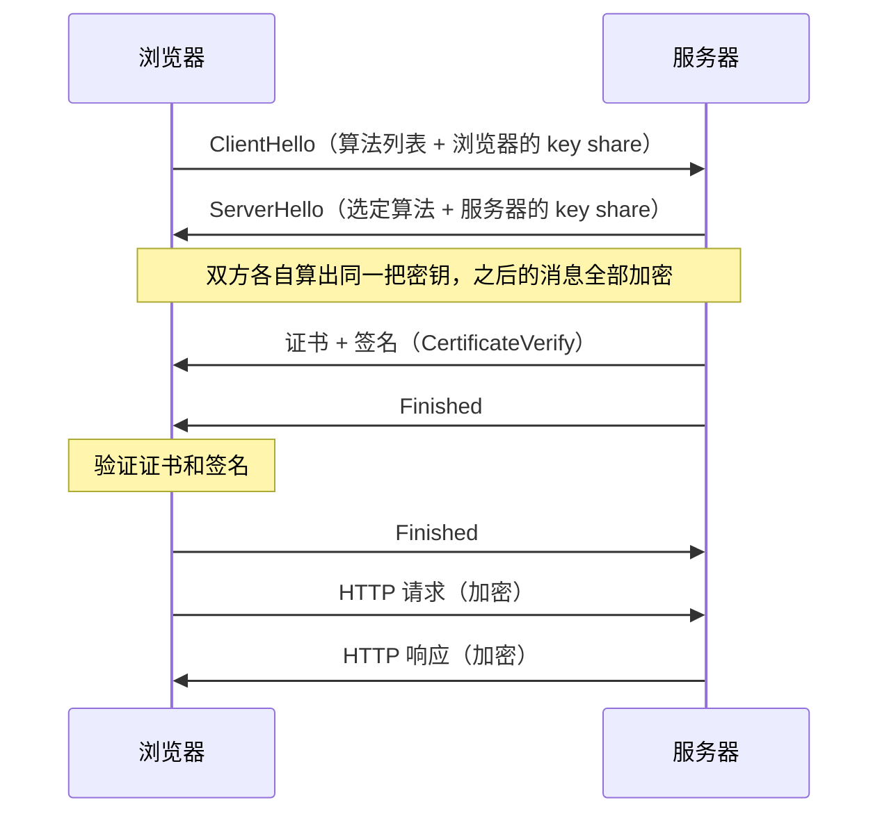

# 流程类 → 第 2 级：HTTPS（TLS 1.3）握手

**请求**：帮我理解 HTTPS（TLS 1.3）握手的过程：浏览器和服务器之间到底发生了什么？用最好懂的方式讲。

**判断**：核心是「两方之间按顺序来回发消息」。文字只能一句接一句地讲，读者要自己在脑子里排时间线。时序图把顺序一次摊开，所以选第 2 级。

---

推荐第 2 级（图）：握手是两方之间的消息顺序，时序图比文字直接。

**文字稿**

TLS 握手的目的有两个：一是让浏览器确认服务器的身份，二是让双方商量出一把只有它们知道的密钥。TLS 1.3 只需要一个来回（1-RTT）就能完成握手。

1. 浏览器发送 ClientHello：支持的加密算法，以及自己的密钥交换参数（key share）。
2. 服务器回复 ServerHello：选定的算法，以及自己的密钥交换参数。
3. 双方各自用两份密钥交换参数算出同一把密钥。从这一步开始，后面的消息都加密。
4. 服务器发送证书，并用私钥签名（CertificateVerify），证明证书是它的。
5. 服务器发送 Finished。浏览器验证证书和签名。
6. 浏览器发送 Finished。握手完成，开始传输网页数据。

**图**

**怎么读这张图**：从上往下是时间顺序。左边是浏览器，右边是服务器。灰色的注释框标出两个关键时刻：从哪里开始加密，浏览器在哪里验证服务器的身份。

---

**需要核对**

- 图里省略了 EncryptedExtensions 等消息，也没有画 0-RTT 恢复连接的情况。需要完整细节时，看 RFC 8446 第 2 节。
