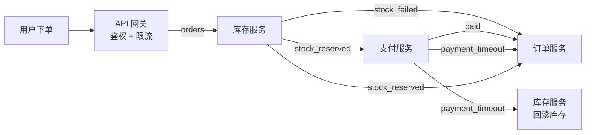
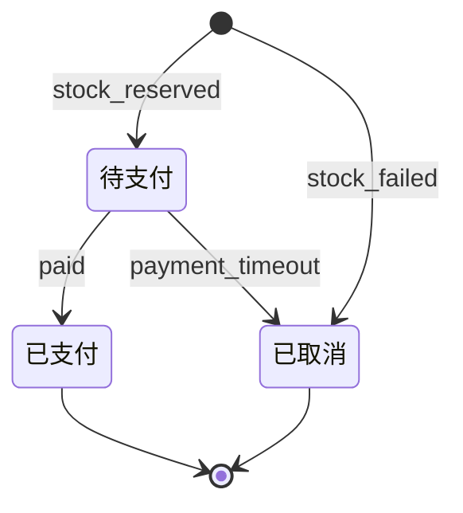

# 解释 AI 产出 → 第 2 级：看懂 agent 写的订单方案

**请求**：用理解阶梯帮我看懂下面这个 agent 写的方案，选最合适的一级讲。

> 方案：把订单服务拆分为三个阶段处理。下单请求先进入 API 网关做鉴权和限流，然后写入 Kafka 的 orders 主题；库存服务消费该主题，扣减库存成功后发布 stock_reserved 事件，失败则发布 stock_failed；支付服务监听 stock_reserved，调用第三方支付，成功后发布 paid，超时 15 分钟未支付则发布 payment_timeout 并触发库存服务回滚；订单服务汇总这些事件更新订单状态（待支付→已支付/已取消）。所有消费者需实现幂等，以事件 ID 去重。

**判断**：这段方案有两种结构：服务之间按事件接力（流程），订单在几个状态之间转换（状态）。没有参数要调，所以不需要第 3 级。用两张图最直接，选第 2 级。

---

推荐第 2 级（图）：方案的核心是「事件在服务之间怎么传」和「订单状态怎么变」，两张图比一段文字清楚。

## 文字稿

这个方案让 4 个服务通过 Kafka 里的事件接力完成一笔订单：

1. API 网关检查身份（鉴权），限制请求频率（限流），然后把订单写进 Kafka 的 `orders` 主题。
2. 库存服务读取订单，扣减库存。成功时发布 `stock_reserved`，失败时发布 `stock_failed`。
3. 支付服务收到 `stock_reserved` 后，调用第三方支付。成功时发布 `paid`。15 分钟内没有支付时，发布 `payment_timeout`，库存服务收到后把库存加回去（回滚）。
4. 订单服务收听这些事件，更新订单状态。

每个服务都要「幂等」：同一个事件收到两次，只处理一次。做法是记下处理过的事件 ID。

## 图 1：事件怎么在服务之间传

怎么读：从左往右读。方框是服务，箭头上的字是 Kafka 里的事件名。库存服务出现两次，右边那个表示收到超时事件后回滚。

## 图 2：订单状态怎么变

怎么读：每个圆角框是一个订单状态，箭头上的字是触发这次变化的事件。

## 需要核对

图是按方案原文画的。下面 3 点方案里没写清，画图时我做了假设，需要你或 agent 确认：

1. **`stock_failed` 时订单变成什么状态？** 原文只写了「待支付→已支付/已取消」。图 2 假设库存失败时订单直接变成「已取消」。
2. **订单服务也收听 `stock_reserved` 吗？** 原文说订单服务「汇总这些事件」。图 1 假设它收听全部事件。
3. **第三方支付失败（不是超时）怎么办？** 原文没有写。这可能是方案的一个缺口。
