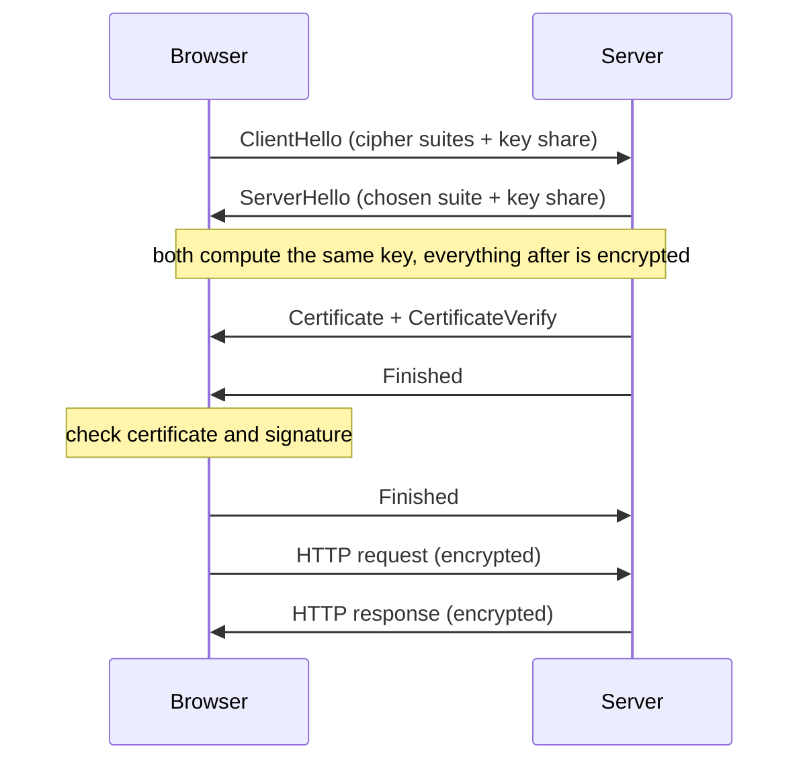

# Rung 2 (English): the TLS 1.3 handshake

**Request:** Help me understand the HTTPS (TLS 1.3) handshake. What actually happens between the browser and the server?

**Rung choice:** the core is messages between two parties, in order. A sequence diagram shows the order at once. Rung 2.

---

Rung 2 (diagram): the handshake is a message sequence between two parties; a sequence diagram shows it faster than text.

**Draft**

The handshake has two goals: the browser confirms the server's identity, and both sides agree on a key that only they know. TLS 1.3 needs one round trip (1-RTT).

1. The browser sends ClientHello: the cipher suites it supports and its key share.
2. The server replies with ServerHello: the chosen cipher suite and its key share.
3. Each side computes the same key from the two key shares. From here on, every message is encrypted.
4. The server sends its certificate and signs the handshake with its private key (CertificateVerify).
5. The server sends Finished. The browser checks the certificate and the signature.
6. The browser sends Finished. The handshake is complete; page data flows.

**How to read it:** time runs top to bottom. The notes mark the two key moments: where encryption starts, and where the browser checks the server's identity.

**What to check**

- The diagram omits EncryptedExtensions and 0-RTT resumption. For full detail, see RFC 8446, section 2.
