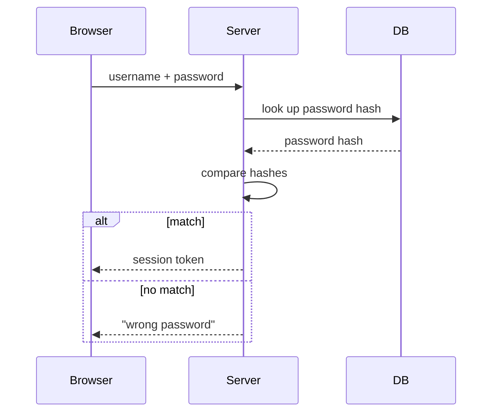

# Rung 2: diagram

## When

The core of the content is **structure**: what connects to what, order, cause and effect, hierarchy, transitions between states. Text can only describe structure one sentence at a time; the reader has to assemble it in their head. A diagram lays it out at once.

## Step 1: choose the type

| Content | Type | Mermaid |
|---|---|---|
| Steps and branches | Flowchart | `flowchart LR` / `flowchart TD` |
| Several parties exchanging messages | Sequence diagram | `sequenceDiagram` |
| Transitions between states | State diagram | `stateDiagram-v2` |
| Parent/child, containment | Hierarchy | `flowchart TD`, or `mindmap` |
| A causes B, B affects C | Causal graph | `flowchart LR`, label edges "increases" / "decreases" |
| Two or three things compared item by item | Table | Markdown table (a table is a diagram too) |

One diagram answers one question. Two questions, two diagrams.

## Step 2: write the rung-1 draft first

Write the plain-text draft (rung-1 rules). Every node and edge must appear in the draft. The diagram adds no new facts.

## Step 3: draw

1. ≤8 words (≤8 Chinese characters) per box. Nouns in boxes, verbs on edges.
2. ≤12 nodes. More than that: split into two diagrams, or collapse detail into a sub-process box.
3. Same kind of thing, same shape. E.g. data = rounded box, step = rectangle, decision = diamond.
4. One direction: left→right or top→bottom.
5. Terms match the draft exactly. If the draft says "token", the diagram does not say "credential".

Where to output:

- If the chat UI renders Mermaid, output a Mermaid code block.
- If layout, color, or annotations matter, write a single-file SVG or HTML in the working directory.
- In Mermaid, quote labels that contain parentheses, quotes, or colons: `A["input (x)"]`. For non-ASCII state names in `stateDiagram-v2`, declare them: `state "已支付" as paid`.

## Step 4: say how to read it

Below the diagram, 2–4 sentences on **how to read it**:

> Read left to right. Rectangles are steps, diamonds are decisions. Red edges are the error path.

## Example

Question: "What happens between the browser, the server, and the database when a user logs in?"

How to read it: time runs top to bottom. Solid arrows are requests, dashed arrows are responses. The boxed part shows two outcomes; only one happens.
