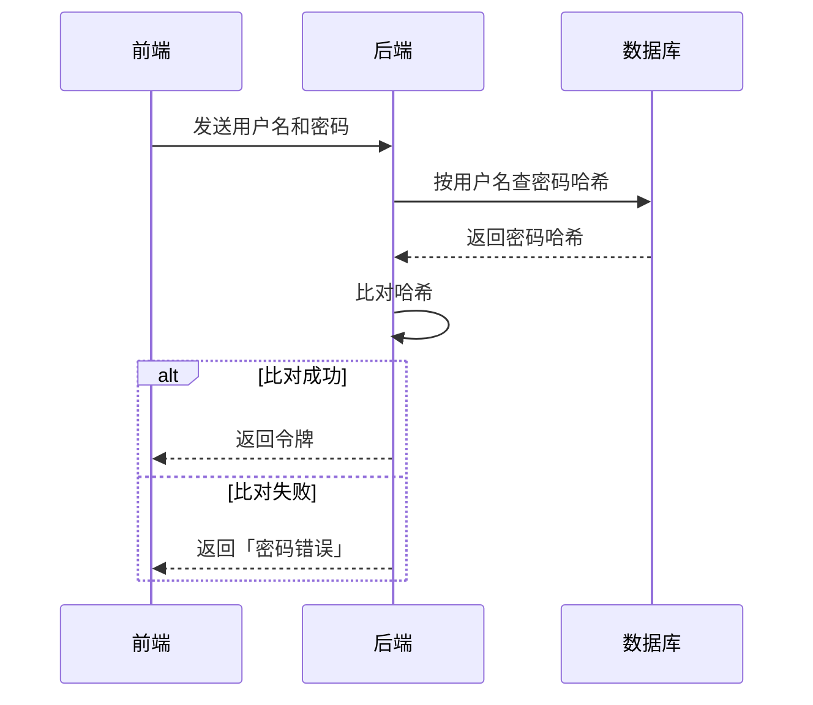

# 第 2 级：图

## 什么时候用

内容的核心是**结构**：谁连着谁、先后顺序、因果、层级、状态之间怎么转换。文字只能一句接一句地讲结构，读者要在脑子里自己拼。图把结构一次摊开。

## 第一步：选图型

| 内容 | 图型 | Mermaid 写法 |
|---|---|---|
| 步骤和分支 | 流程图 | `flowchart LR` / `flowchart TD` |
| 几个参与者之间来回发消息 | 时序图 | `sequenceDiagram` |
| 状态之间怎么转换 | 状态图 | `stateDiagram-v2` |
| 上下级、包含关系 | 层级图 | `flowchart TD`，或 `mindmap` |
| A 导致 B，B 又影响 C | 因果图 | `flowchart LR`，边上写「增加」「减少」 |
| 两三个东西逐项对比 | 表格 | Markdown 表格（表格也是图） |

一张图只回答一个问题。两个问题就画两张图。

## 第二步：先写文字稿

按 `plain-chinese` 的规则写一段文字稿。图里的每个节点、每条边，都要能在文字稿里找到。图不引入新事实。

## 第三步：画图

规则：

1. 每个框不超过 8 个字。框里写名词，边上写动作（动词）。
2. 节点不超过 12 个。超过时拆成两张图，或者把细节收进一个「子流程」框。
3. 同一种东西用同一种形状。例如：数据用圆角框，处理步骤用方框，判断用菱形。
4. 箭头方向一致：从左到右，或从上到下。
5. 术语和文字稿完全一致。文字稿叫「令牌」，图里就不写「token」。

输出位置：

- 聊天界面能渲染 Mermaid 时，直接输出 Mermaid 代码块。
- 需要精确布局、颜色或注释时，写一个单文件 SVG 或 HTML，保存到当前目录。
- Mermaid 语法里，含括号、引号、冒号的文字要用双引号包起来，例如 `A["输入 (x)"]`。

## 第四步：图下的说明

图下写 2–4 句话，告诉读者**怎么读这张图**：

> 从左往右读。每个方框是一个步骤，菱形是一次判断。红色的边是出错时走的路径。

## 示例

问题：「用户登录时，前端、后端和数据库之间发生了什么？」

怎么读：从上往下是时间顺序。实线箭头是请求，虚线箭头是返回。框住的部分是两种结果，只会发生其中一种。
